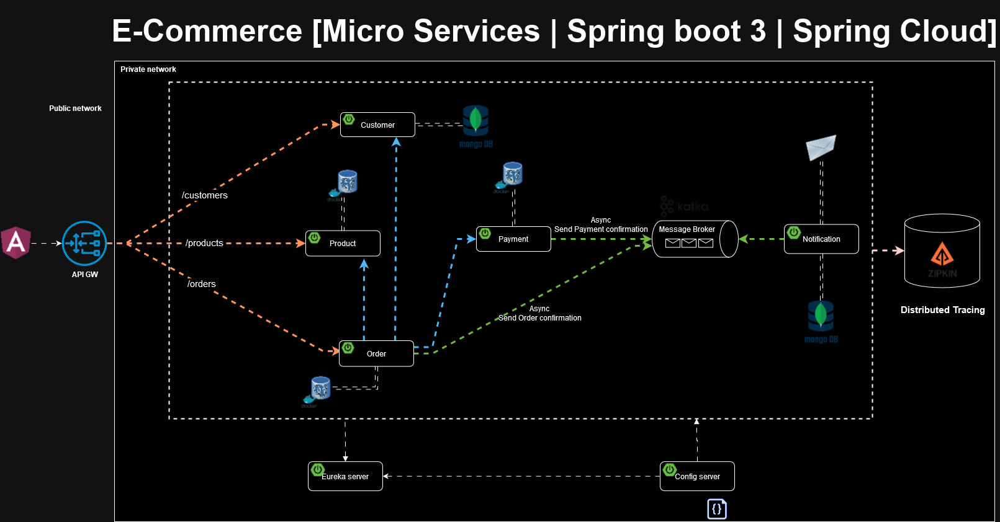

# Ecommerce REST приложение с микросервисной архитектурой



## Описание проекта

Этот проект представляет собой систему заказа товаров, построенную на основе **микросервисной архитектуры**. В приложение входят 5 микросервисов, которые взаимодействуют друг с другом через асинхронные и синхронные механизмы обмена сообщениями.

### Основные возможности:
- Разработка процесса создания заказа с интеграцией нескольких микросервисов через **Feign Client** и **RestTemplate**.
- Взаимодействие с сервисами управления клиентами, продуктами и уведомлениями.
- Асинхронная отправка подтверждений заказов через **Kafka**.
- Сервис для асинхронных уведомлений по электронной почте, отправляющий клиентам письма с подтверждением заказа и оплаты.
- Внедрение **Zipkin** для распределенной трассировки запросов между микросервисами.

## Используемые технологии

- **Spring Boot** — для создания REST API.
- **Spring Cloud Gateway** — для маршрутизации запросов между сервисами.
- **Kafka** — для асинхронной передачи сообщений и обработки данных между микросервисами.
- **Keycloak** — для управления аутентификацией и авторизацией пользователей (OAuth2 и JWT).
- **MongoDB** и **PostgreSQL** — для хранения данных (каталог продуктов, информация о пользователях и т.д.).
- **Docker** и **Docker Compose** — для контейнеризации сервисов и их оркестрации в локальной среде разработки.
- **Zipkin** — для распределенной трассировки запросов с целью мониторинга и устранения проблем в производительности.

## Архитектура

Проект состоит из следующих микросервисов:
1. **Customer Service** — управление клиентами.
2. **Product Service** — управление продуктами.
3. **Order Service** — обработка заказов.
4. **Payment Service** — обработка платежей.
5. **Notification Service** — отправка уведомлений.
6. **Gateway Service** — маршрутизация запросов.
7. Discovery Service — регистрация микросервисов.
8. Config Service — конфигурационный файл для всех микросервисов.

## Стек технологий

- **Java 17**
- **Spring Boot 3**
- **PostgreSQL**
- **MongoDB**
- **Kafka**
- **Docker Compose**
- **Zipkin**
- **Flyway**
- **Lombok**
- **Slf4j**

## Как запустить

1. Клонируйте репозиторий:
   ```bash
   git clone https://github.com/SverdlovSemen/e-commerce-app

2. Перейдите в папку проекта и выполните Docker Compose:
   ```bash
    docker-compose up --build

3. После сборки, сервисы будут доступны по следующим URL:
  - Gateway: http://localhost:8080
  - Zipkin: http://localhost:9411

## Дополнительная информация

Для авторизации используется Keycloak. Дефолтные учетные данные для доступа:
- Admin: admin/admin
- User: user/user

**Примечание: Убедитесь, что у вас запущены все зависимости через Docker Compose перед запуском приложения.**
